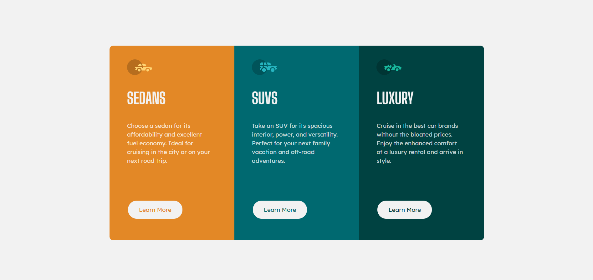

# Frontend Mentor - 3-Column Preview Card Component Solution

This is a solution to the [3-column preview card component challenge on Frontend Mentor](https://www.frontendmentor.io/challenges/3column-preview-card-component-pH92eAR2-). Frontend Mentor challenges help you improve your coding skills by building realistic projects. 

## Table of contents

- [Overview](#overview)
  - [The challenge](#the-challenge)
  - [Screenshot](#screenshot)
- [My process](#my-process)
  - [Built with](#built-with)
  - [What I learned](#what-i-learned)
  - [Continued development](#continued-development)
- [Author](#author)

## Overview

### The challenge

Users should be able to:

- View the optimal layout depending on their device's screen size
- See hover states for interactive elements

### Screenshot

## My process

### Built with

- HTML5
- CSS
- Bootstrap

### What I learned

I learned how to make a 3-column layout.

### Continued development

Looking forward for the upcoming challenges.

## Author

- Frontend Mentor - [@SravanSTG](https://www.frontendmentor.io/profile/SravanSTG)
- Twitter - [@yourusername](https://www.twitter.com/yourusername)
