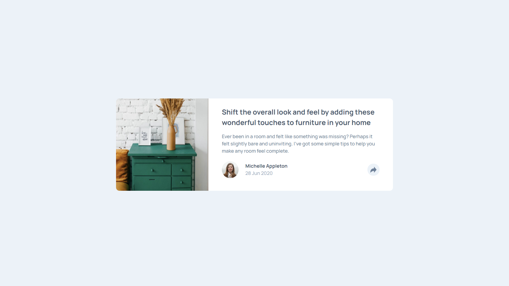

# Frontend Mentor - Article Preview Component Solution

This is a solution to the [Article preview component challenge on Frontend Mentor](https://www.frontendmentor.io/challenges/article-preview-component-dYBN_pYFT). Frontend Mentor challenges help you improve your coding skills by building realistic projects. 

## Table of contents

- [Overview](#overview)
  - [The challenge](#the-challenge)
  - [Screenshot](#screenshot)
- [My process](#my-process)
  - [Built with](#built-with)
  - [What I learned](#what-i-learned)
  - [Continued development](#continued-development)
- [Author](#author)

## Overview

### The challenge

Users should be able to:

- View the optimal layout for the component depending on their device's screen size
- See the social media share links when they click the share icon

### Screenshot

## My process

### Built with

- HTML5 markup
- CSS custom properties
- Flexbox
- Javascript

### What I learned

I learned how to make a component appear and disapper on click.

### Continued development

I would like to better with DOM manipulation in future challenges.

## Author

- Frontend Mentor - [@SravanSTG](https://www.frontendmentor.io/profile/SravanSTG)
